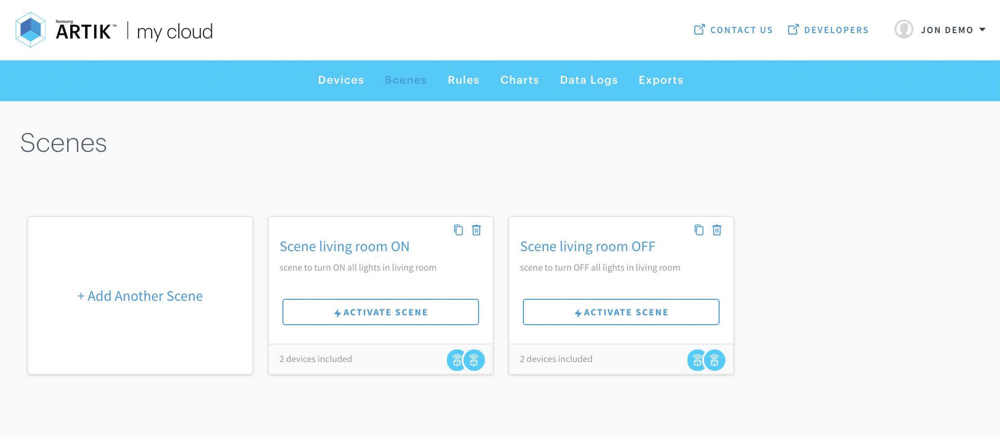

# Sample Create Scenes (nodejs)

This sample demonstrates API call to create a Scene into your ARTIK cloud services account.   

**Prerequisites**

1. Node and Npm

* Node version >= 9.8.0
* Npm version >= 5.8.1

Check your version by typing:

```bash
%> node --version
v9.8.0
%> npm --version
v5.8.1
```

2. You should be familiar with ARTIK cloud services to create an application, device types, and adding devices into your account.

### Setup / Installation

1. Create a Device Type (or existing one) which has defined the "setOn" and "setOff" actions.
2. Add 2 device instances (of above Device Type) and note down the "device Id" from [Device Dashboard](https://my.artik.cloud/devices).
3. [Create an Application](https://developer.artik.cloud/documentation/user-management/authentication.html) (or existing one).  Be sure your application set "Read and Write" permissions to add a special device type Scene with the unique name: cloud.artik.scene.    This will enable the Scenes API to work.    Additionally, be sure your application has added and set "Read and Write" permissions for your Device Type from step #1.   
4. Login to your newly created application and note down the "user token".

### **Code setup**

1. Edit the `config.json` and add your "user token" and the 2 device Ids retrieved earlier.   

```javascript
{
	"user_token": "your_user_token",
	"device1_id": "your_device1_id",
	"device2_id": "your_device2_id",
}
```

2. Simply examine the top of the`create-scene.json`file and note that 2 scenes will be created.   One for turning on all the lights and one for turning off all the lights.  

```javascript
//when scene activiated, will call "setOn" on each of the devices.
var scene_on = {
  "name": "Scene living room ON",
  "description": "scene to turn ON all lights in living room",
  "actions": [
	  {
	  	"ddid": config.device1_id,
	  	"action": "setOn",
	  	"parameters": {}
	  },
	  {
	  	"ddid": config.device2_id,
	  	"action": "setOn",
	  	"parameters": {}
	  }, 
	]
};

//when activated, will call "setOff" on each of the devices.
var scene_off = {
  "name": "Scene living room OFF",
  "description": "scene to turn OFF all lights in living room",
  "actions": [
	  {
	  	"ddid": config.device1_id,
	  	"action": "setOff",
	  	"parameters": {}
	  },
	  {
	  	"ddid": config.device2_id,
	  	"action": "setOff",
	  	"parameters": {}
	  }
	]
};
```

3. Finally install any dependencies by typing:

```
%> npm install
```

###Run sample  

Run the script via command line to create 2 scenes into your account.

```
%> node create_scene.js
```

Here is output:

```javascript
1. Making request Creating Scene 1:  Scene living room ON
2. Making request Creating Scene 2:  Scene living room OFF

Response data of API calls are shown below ... 
{
  "data": {
    "id": "889c4d3d7e1f49a1b17d7e560b983ad1",
    "uid": "...",
    "aid": "...",
    "name": "Scene living room ON",
    "description": "scene to turn ON all lights in living room",
    "actions": [
      {
        "ddid": "id-for-device1",
        "action": "setOn",
        "parameters": {}
      },
      {
        "ddid": "id-for-device2",
        "action": "setOn",
        "parameters": {}
      }
    ],
    "error": null
  }
}

{
  "data": {
    "id": "874f47fafb9a482d968c9c674524d80d",
    "uid": "...",
    "aid": "...",
    "name": "Scene living room OFF",
    "description": "scene to turn OFF all lights in living room",
    "actions": [
      {
        "ddid": "id-for-device1",
        "action": "setOff",
        "parameters": {}
      },
      {
        "ddid": "id-for-device2",
        "action": "setOff",
        "parameters": {}
      }
    ],
    "error": null
  }
}
```

### 2. View the Scene in your Account   

You can verify the scene is added to the account by visiting the [Scenes dashboard](https://my.artik.cloud/scenes).    

The `list_scenes.js` file is also available to list all the scenes in your account

```
%> node list-scenes.js

{"count":2,"offset":0,"total":2,"data":{"scenes":[{"id":"7daa96ebaf724186887beece293d5ab0","uid":"...","aid":"...","name":"Scene Living Room ON","description":"scene to turn ON all lights in living room","actions": "setOn", ...
```

More about ARTIK cloud services
---------------

If you are not familiar with ARTIK cloud services, we have extensive documentation at https://developer.artik.cloud/documentation

The full ARTIK cloud services API specification can be found at https://developer.artik.cloud/documentation/api-reference/

Peek into advanced sample applications at https://developer.artik.cloud/documentation/tutorials/code-samples/

To create and manage your services and devices on ARTIK cloud services, visit the Developer Dashboard at https://developer.artik.cloud

License and Copyright
---------------------

Licensed under the Apache License. See [LICENSE](LICENSE).

Copyright (c) 2018 Samsung Electronics Co., Ltd.
